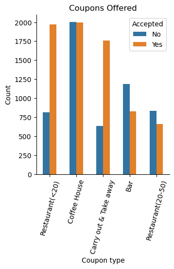
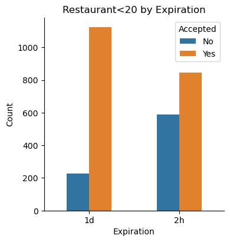
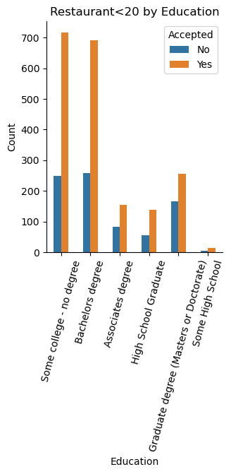
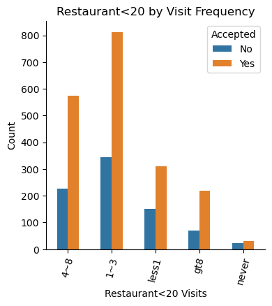
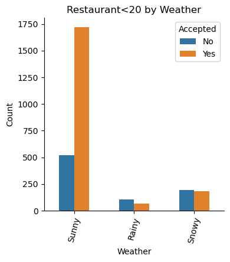

# Practical Application 5.1 - Customer Coupons #
* Work done for the complete analysis including statistics, observations, and visualizations available in:

    [Jupiter Notebook used](https://github.com/ndhomse/coupon-analysis/blob/main/notebook/Practical_App_5.1.ipynb)
### Problem statement ###
Build a system to answer the question: **Will a customer accept the coupon?**

### Input data ###
The data we have was collected via a survey that describes different driving scenarios, including the destination, current time, weather, passenger, etc., and then asks people whether they will accept the coupon if they are the driver. The driver responses are logged as a summary Yes(1) or No(0).

There are five different types of coupons:
1. less expensive restaurants (under \$20), 
2. coffee houses, 
3. carry out and take away,
4. bars, and 
5. more expensive restaurants ($20-50)

### Investigation and decisions on missing or problematic data ###

1. **car** column has only 108 non-null values - missing 12576 values 
    - we will ignore car column for analysis
2. **age** column has categoric info for some rows - 'below21' for ages below 21 and '50plus' for ages above 50
    - We will replace with values 20 for 'below21' and 51 for '50plus' and make the age column numeric for cleaner analysis
3. columns '**Bar**', '**CoffeeHouse**', '**CarryAway**', '**RestaurantLessThan20**', '**Restaurant20To50**' have small number of rows (~200) with null values.
    - We will ignore those values for analysis

### Analysis and Findings from the data ###

1. 57% of the offered coupons were accepted
2. Coffee House are the most issued(31.5%), with acceptance rate of about 50%
3. Restaurant(<20) and Carry out have the most acceptance proportion - 71% and 73.5% resp.

   

## Investigating Bar coupons ##

### Analysis and Findings on Bar coupons ###
1. 41% of bar coupons were accepted
2. Acceptance rate for those who went to bar more than 3 times a month (77%) is <u>more than double</u> that of those who did not (37%)
3. Acceptance rate with those who went to bar more than once a month and over age 25 (77%) is more than double that of those who did not (38%)
-- <i>Age > 25 category does not seem to have a significant impact in this scenario - propensity of going to bar more frequently does
4. Acceptance rate is higher for drivers who go to bars more than once a month and had passengers that were not a kid and had occupations other than farming, fishing, or forestry (71%) compared to the rest of the drivers (40%)
5. 71% acceptance rate for those who go to bars more than once a month, had passengers that were not a kid, and were not widowed
6. 45% acceptance rate for drivers who go to cheap restaurants more than 4 times a month and income is less than 50K

**Hypothesis about drivers who accepted the bar coupons**
1. The biggest of these factors seems to be how often they go to the bar - bar visitors of more than once a month are far more likely to accept Bar coupons
2. Age seems to have some influence - as observed higher proportion of acceptance in those under 30 category - should be explored further

## Investigating Restaurant(<20) coupons ##
### Problem statement for Restaurant(<20) coupons ###
1. Identify features that impact acceptance proportion of Restaurant(<20) coupons and note those that do not have any notable impact

### Analysis and Findings on the Restaurant(<20) coupons ###
1. 71% of Restaurant<20 coupons were accepted
2. No significant difference by gender on acceptance proportion (70% for female, 72% for male drivers)
3. Higher proportion of coupons accepted if expiration was 1 day(83%) vs 2 hours(59%)
               
4. Drivers with some college(74%) or bachelors degree(73%) seem to have higher acceptance ratio

5. No notable influence observed from differences in income levels
6. Higher frequency of visits per month seem to produce somewhat higher acceptance -- ~72% of those visiting these restaurants more than once a month accept the coupons vs 66% amongst those who do not

7. Acceptance rate for these restaurants much higher in sunny weather (77%) -- this is higher acceptance rate than that for all coupons in sunny weather (59.5%)

**Key Finding**
                        
- <i>Coupons expiring in 1 day, sunny weather, drivers with some college or Bachelors degree, visitors frequenting these restaurants more than once a month seem to produce higher acceptance ratios</i>

**Next Steps and recommendations**
1. Expiry, Weather, education, prior visit frequency should be investigated as key potential features for further analysis and when building the ML model

    